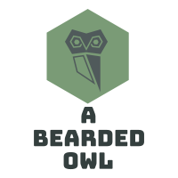

[![Forks][forks-shield]][forks-url]
[![Stargazers][stars-shield]][stars-url]
[![Issues][issues-shield]][issues-url]
[![LinkedIn][linkedin-shield]][linkedin-url]


<!-- PROJECT LOGO -->
<br />
<p align="center">
  <a href="https://github.com/jhyoung09/ITAM-Crawler">
    
  </a>

  <h3 align="center">An Asset Data Compile Tool</h3>
  <h4 align="center">ITAM-Crawler</h4>

  <p align="center">
    <br />
    <a href="https://github.com/jhyoung09/ITAM-Crawler"><strong>Explore the docs »</strong></a>
    <br />
    <br />
    <a href="https://github.com/jhyoung09/ITAM-Crawler">View Demo</a>
    ·
    <a href="https://github.com/jhyoung09/ITAM-Crawler/issues">Report Bug</a>
    ·
    <a href="https://github.com/jhyoung09/ITAM-Crawler/issues">Request Feature</a>
    ·
    <a href="https://github.com/jhyoung09/ITAM-Crawler/pulls">Send a Pull Request</a>
  </p>
</p>


<!-- TABLE OF CONTENTS -->
## Table of Contents

- [Table of Contents](#table-of-contents)
- [About The Project](#about-the-project)
  - [Built With](#built-with)
  - [Prerequisites](#prerequisites)
- [Roadmap](#roadmap)
- [Contributing](#contributing)
- [License](#license)
- [Contact](#contact)
- [Acknowledgements](#acknowledgements)


<!-- ABOUT THE PROJECT -->
## About The Project

[![Product Name Screen Shot][product-screenshot]](https://example.com)

This project started out as a way to push myself to learn more python but also to automate a time consuming task that I do not have the time to do every week, but is a report required for my project.

The use case is to compile asset data that field technicians are gathering while upgrading sites during our project. We have to compile all of this data and provide it to our IT Asset Management team and our Finance team so assets can be settled in the books. 


### Built With
This has been built in Python 3.7.4 utilizing the below libraries. 
* [openyxl](https://openpyxl.readthedocs.io/en/stable/)


<!-- GETTING STARTED -->
<!--## Getting Started

This is an example of how you may give instructions on setting up your project locally.
To get a local copy up and running follow these simple example steps.

### Prerequisites

This is an example of how to list things you need to use the software and how to install them.
* npm
```sh
npm install npm@latest -g
```
-->

<!-- ### Installation

1. Get a free API Key at [https://example.com](https://example.com)
2. Clone the repo
```sh
git clone https://github.com/your_username_/Project-Name.git
```
3. Install NPM packages
```sh
npm install
```
4. Enter your API in `config.js`
```JS
const API_KEY = 'ENTER YOUR API';
```
-->


<!-- USAGE EXAMPLES -->
<!-- ## Usage

Use this space to show useful examples of how a project can be used. Additional screenshots, code examples and demos work well in this space. You may also link to more resources.

_For more examples, please refer to the [Documentation](https://example.com)_
-->


<!-- ROADMAP -->
## Roadmap

See the [open issues](https://github.com/jhyoung09/ITAM-Crawler/issues) for a list of proposed features (and known issues).


<!-- CONTRIBUTING -->
## Contributing

Contributions are what make the open source community such an amazing place to be learn, inspire, and create. Any contributions you make are **extremely appreciated**.

1. Fork the Project
2. Create your Feature Branch (`git checkout -b feature/AmazingFeature`)
3. Commit your Changes (`git commit -m 'Add some AmazingFeature'`)
4. Push to the Branch (`git push origin feature/AmazingFeature`)
5. Open a Pull Request


<!-- LICENSE -->
## License 

Distributed under the MIT License. See `LICENSE` for more information.


<!-- CONTACT -->
## Contact

Hunter Young - hunter@youngs.us

<!-- Project Link: [https://github.com/your_username/repo_name](https://github.com/your_username/repo_name) -->


<!-- ACKNOWLEDGEMENTS -->
## Acknowledgements
* [kvosbur](https://github.com/kvosbur), thank you for all of your help and teaching during this project.
* [Img Shields](https://shields.io)
* [GitHub Pages](https://pages.github.com)
* [r/learnpython](https://www.reddit.com/r/learnpython/)
* [Roshan Lamichhane](https://github.com/roshanlam/ReadMeTemplate), for his awesome readme template


<!-- MARKDOWN LINKS & IMAGES -->
<!-- https://www.markdownguide.org/basic-syntax/#reference-style-links -->
[forks-shield]: https://img.shields.io/github/forks/roshanlam/ReadMeTemplate?style=for-the-badge
[forks-url]: https://github.com/jhyoung09/ITAM-Crawler/network/members
[stars-shield]: https://img.shields.io/github/stars/roshanlam/ReadMeTemplate?style=for-the-badge
[stars-url]: https://github.com/jhyoung09/ITAM-Crawler/stargazers
[issues-shield]: https://img.shields.io/github/issues/roshanlam/ReadMeTemplate?style=for-the-badge
[issues-url]: https://github.com/jhyoung09/ITAM-Crawler/issues
[linkedin-shield]: https://img.shields.io/badge/-LinkedIn-black.svg?style=flat-square&logo=linkedin&colorB=555
[linkedin-url]: https://www.linkedin.com/in/jameshunteryoung/
